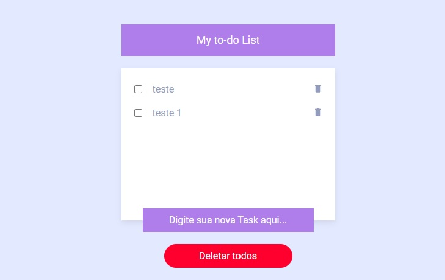

# App To-Do List - Angular 2+

A implementação deste projeto, tem como finalidade, treinar conceitos básicos do angular.


## Autores

- [@lucassantanar](https://www.github.com/lucassantanar)


## Tela de demonstração




## Deploy

Para fazer o deploy desse projeto

```bash
  foi utilizado a biblioteca angular-cli-ghpages
```


## Funcionalidades

- Aplicacação permite inserção, edição e exclusão e uma unica ou de todas as tarefas adicionadas.


## Stack utilizada

**Front-end:** Angular 2+, SCSS


## Rodando localmente

Clone o projeto

```bash
  git clone https://github.com/lucassantanar/to-do-list-angular2-.git
```

Entre no diretório do projeto

```bash
  cd app-todo
```

Instale as dependências

```bash
  npm install
```

Inicie o servidor

```bash
  ng s
```

## Documentação de cores

| Cor               | Hexadecimal                                                |
| ----------------- | ---------------------------------------------------------------- |
| Cor Primária      |  #af7eeb |
| Cor Secundária       |  #939cbd |
| Cor Terciária       |  #ffffff |


## Aprendizados

Neste projeto foi possivél absorver o entendimento de comunicação entre componentes através do decorator @input()/@output(), separação da aplicação atraves de módulos, utilização de diretivas entre outros fundamentos do Angular. 

